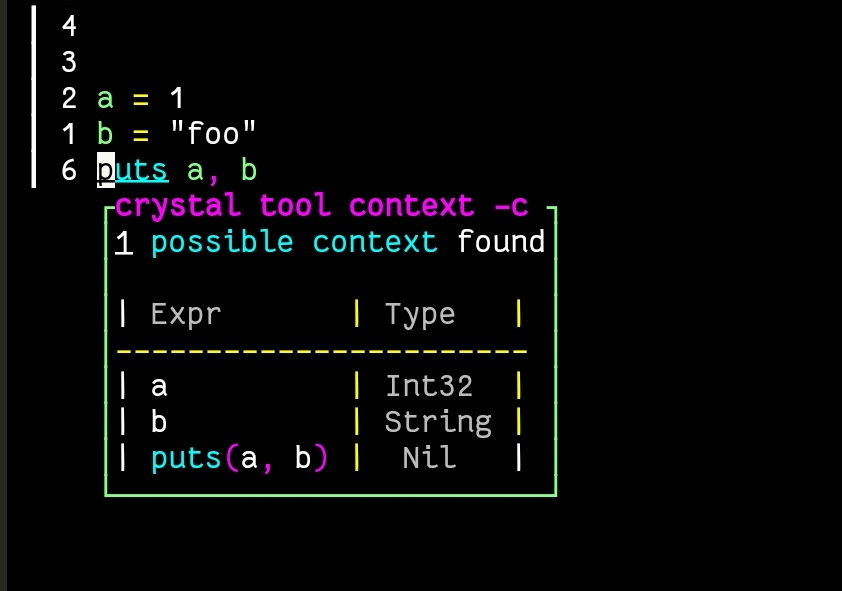
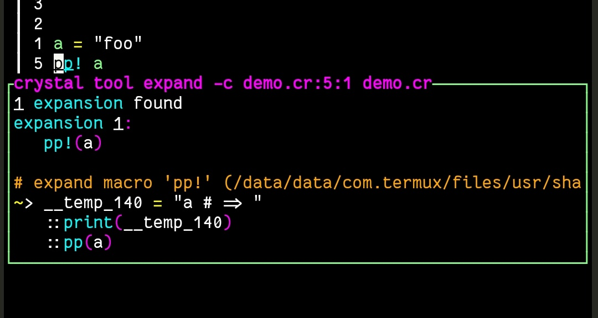
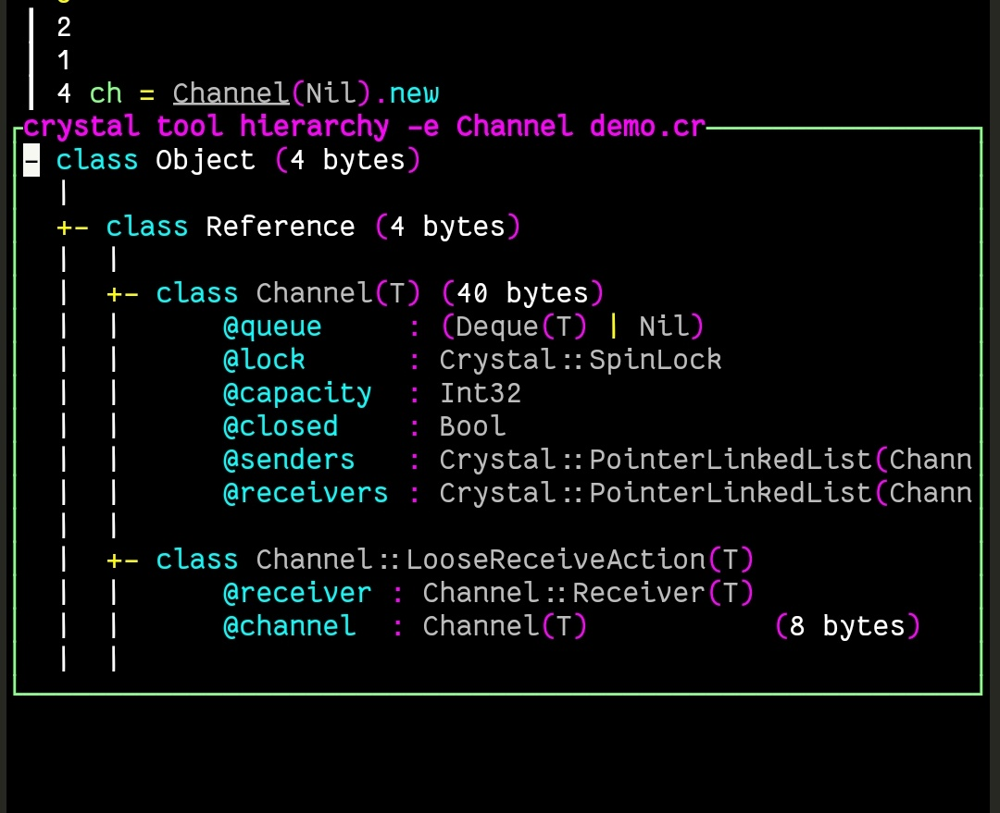
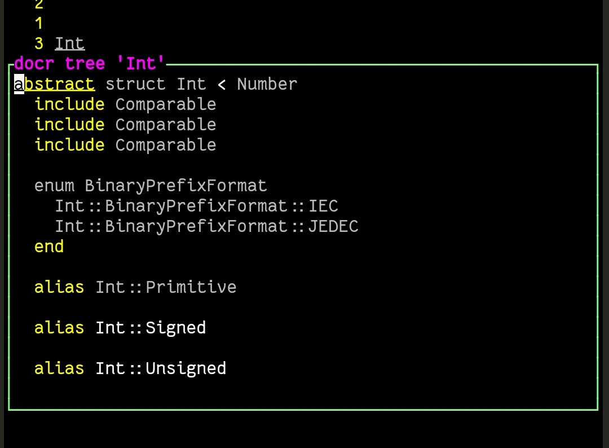
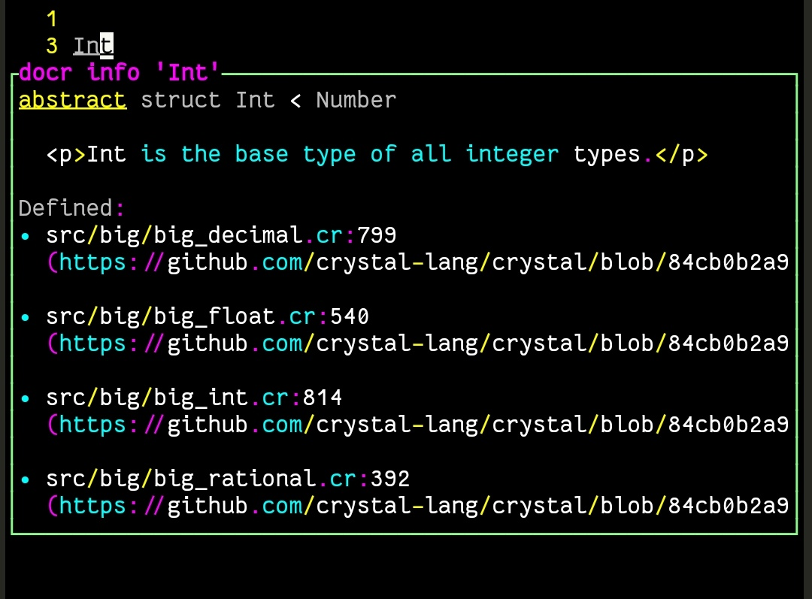
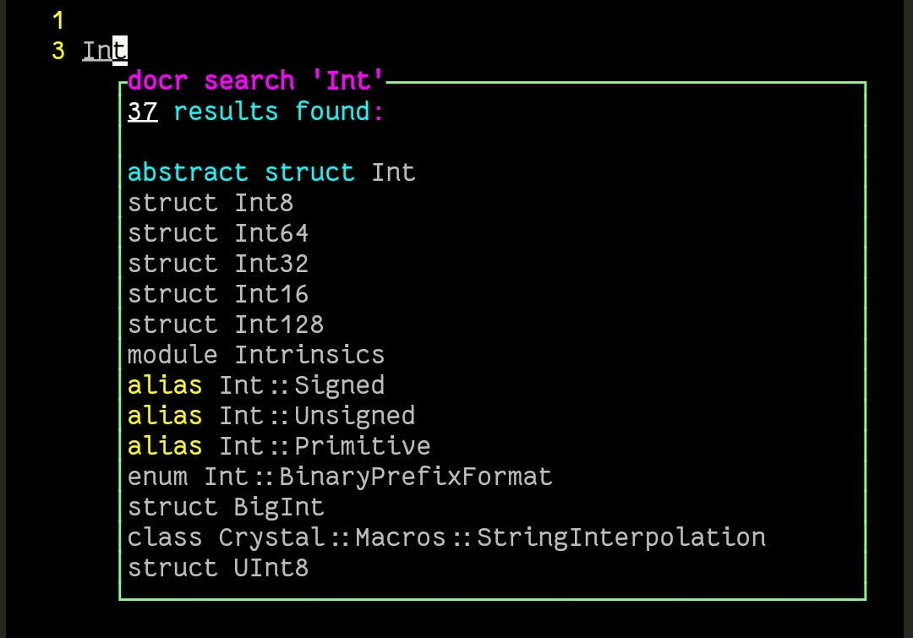

# crystal.nvim

## Installation

- lua

```lua
{"lost22git/crystal.nvim", lazy=false, config=true}
```

- fennel

```fennel
{1 "lost22git/crystal.nvim" :lazy false :config true}
```

## Default Keymaps

|mode|key|function| demo |
|:----|:----|:----|:----:|
| n | \<Leader>kc | crystal tool context |  |
| n | \<Leader>ke | crystal tool expand |  |
| n,v | \<Leader>kh | crystal tool hierarchy |  |
| n | \<Leader>ki| crystal tool implementations |  |
| n,v | \<Leader>kk | docr tree |  |
| n,v | \<Leader>k | docr info |  |
| n,v | \<Leader>K | docr search |  |
